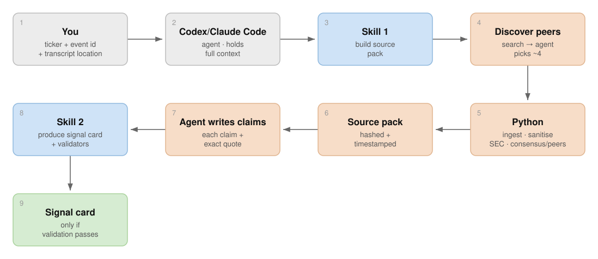
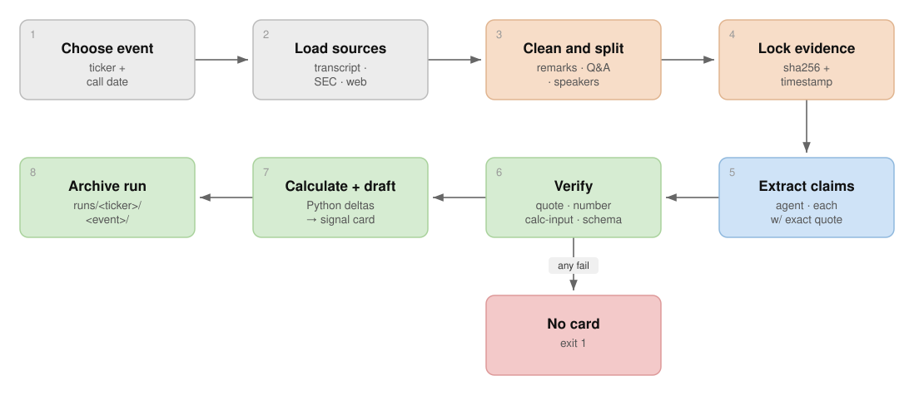

# Earnings Transcript Analysis (POC)

Earnings analysis needs two different skills at once: mechanical accuracy
(did the company really say that number?) and interpretation (what does it
mean, and is it a fair reading?). This project keeps those two skills
separate rather than blending them. Deterministic Python code handles what
can be proved — quotations, numbers, calculations, provenance. A large
language model (an "agent") handles synthesis, prioritisation, and judgment.
An independent second agent pass then challenges the resulting analysis
before it's considered final.

## What this project does

It turns:

```text
earnings transcript
+ regulatory financial data
+ consensus / peer research
```

into:

```text
grounded claims
→ validated signal card
→ forward-looking outlook
→ independent semantic review
```

This is a proof of concept, not an investment recommendation or a production
research system. No MCP server or paid LLM API call happens in the product
code — the only "LLM" involved is the agent you're chatting with (Codex,
Claude Code, or similar), reading the repo-scoped skills under
`.agents/skills/`.

## How it works

**Overall: one agent, three skills, in order.**



**Inside `prepare` and `analyze`, one level more detailed:**



<sub>Diagrams are generated by `scripts/make_diagrams.py` (edit the box data there, then rerun `python3 scripts/make_diagrams.py` to regenerate the SVGs under `docs/`).</sub>

Four ideas hold this design together:

1. **Evidence comes in from three places** — the transcript itself, SEC's
   filed financial data, and web research for what the call doesn't say
   (analyst consensus, peer results). None of it is trusted yet.
2. **Python establishes and validates the evidence boundary.** Every source
   is fetched, sanitised, and hashed before an agent ever reads it, and every
   claim the agent later writes is checked back against that same boundary —
   exact quote, real number, correct calculation. Nothing partial or
   unverified is ever produced.
3. **The agent reasons inside that boundary, not around it.** It decides
   what's worth reporting, drafts the interpretive outlook, and builds
   scenarios — but every substantive claim it makes must trace back to
   something Python can mechanically confirm.
4. **A second, independent agent pass challenges the reasoning.** A
   fresh-context reviewer — with no memory of why any drafting decision was
   made — judges fairness, narrative balance, and completeness: the things a
   mechanical check structurally cannot judge.

In short: **Python establishes the evidence boundary; the LLM reasons within
it.**

### What Python does vs. what the LLM does

| Python is responsible for | LLM is responsible for |
| --- | --- |
| Source provenance | Finding material developments |
| Exact-quote checks | Interpreting management commentary |
| Numeric grounding | Connecting evidence across sources |
| Reproducible calculations | Identifying tensions and implications |
| Hash/version integrity | Building scenarios |
| Workflow gates | Judging materiality and narrative |

## Typical workflow

1. Discover peers
2. Prepare the evidence pack
3. Extract and validate claims
4. Build and validate the outlook
5. Independently review the analysis

Each of these is one or two CLI commands plus an agent step; see
[docs/WORKFLOW.md](docs/WORKFLOW.md) for the full manual sequence, exit
codes, and file-by-file detail.

## Quick start

```bash
uv sync --extra dev
uv run earnings --help
```

A representative run looks like:

```bash
uv run earnings discover-peers --ticker MSFT --company-name "Microsoft"
uv run earnings prepare --ticker MSFT --event-id 2026-q2 \
  --transcript path/or/url --company-name "Microsoft" --event-date 2026-07-29 \
  --peers "Alphabet" "Amazon" "Oracle" "Apple"
# agent writes claims.json, then:
uv run earnings analyze --ticker MSFT --event-id 2026-q2
# agent writes outlook-brief.md, then:
uv run earnings validate-outlook --ticker MSFT --event-id 2026-q2
# agent runs the independent review, then:
uv run earnings check-review --ticker MSFT --event-id 2026-q2
```

Point your agent at this repo and it will discover the skills under
`.agents/skills/<name>/SKILL.md` on its own — you don't need to paste any of
this in manually. Full command reference: `uv run earnings <command> --help`.

## What the project produces

For each ticker/event, a run directory under `runs/<ticker>/<event-id>/`
holding:

- prepared and archived evidence (the transcript, SEC financials, extracted
  web content — all hashed and timestamped);
- validated, quote-anchored claims;
- a signal card (`signal-card.md`) — the checked, structured factual base;
- a forward-looking outlook brief (`outlook-brief.md`) — base/upside/downside
  scenarios;
- deterministic validation receipts for every check that ran;
- an independent review trail, including any correction rounds.

See [docs/WORKFLOW.md](docs/WORKFLOW.md#run-output-layout) for the exact file
layout and what writes each file.

## Current status / limitations

This is a proof of concept: thin retry/pagination handling, an
industry-agnostic but heuristic transcript segmenter, and a handful of
documented edge cases in web-provider causality checking and number parsing.
Treat any output as a draft for human review, not an investment
recommendation. See [docs/REFERENCE.md](docs/REFERENCE.md#known-limitations)
for the full list.

## Further reading

- [docs/WORKFLOW.md](docs/WORKFLOW.md) — complete manual and agent workflow
- [docs/AUDITABILITY.md](docs/AUDITABILITY.md) — provenance, validation, hashes and review controls
- [docs/REFERENCE.md](docs/REFERENCE.md) — configuration, providers, SEC behaviour and operational details
- `.agents/skills/` — canonical instructions used by agents
