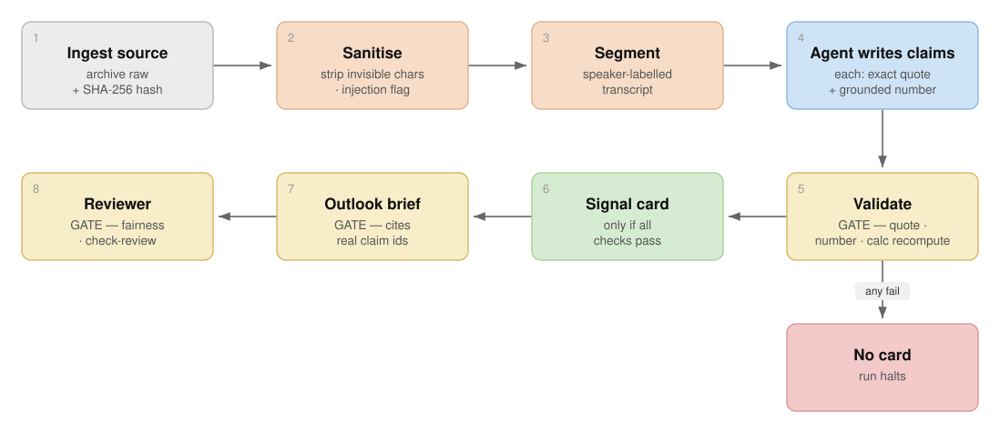

# How This Project (Earnings Transcript Analyser) Stays Auditable: Governance & Quality Control

*A plain-language guide for non-technical readers. It explains how an earnings-call
transcript becomes a set of checked, traceable claims — and why you can trust each number.*

## Two kinds of checking

Every figure in this pipeline passes through two very different kinds of quality control:

- **Machine checks (Python).** Fast and exact — the computer confirms mechanical facts: did
  this quote really appear in the transcript? Does this number exist in the source? Such checks
  never tire and never have an opinion.
- **Human-style judgement (a reviewer agent).** Some things a computer cannot judge — is a
  claim a *fair* summary, is anything important missing? A separate reviewer step handles those.

Several of these checks are **gates**: the process physically stops and refuses to produce a
final result until the check passes. Nothing half-finished is ever released.

The diagram below is the whole pipeline, left to right, with the check performed at each step
written underneath it. The three **gold boxes are gates** — the run halts there unless the
check passes (the red box shows what "halt" means: no card is produced). The numbered sections
that follow explain each check in turn.



## 1. Every source is fingerprinted (manifests & hashes)

When a transcript (or a web page, or an SEC filing) is pulled in, the system records it in a
*manifest* — a catalogue of everything used, with a digital fingerprint (a "hash") of the
exact content. The hash we use is **SHA-256**, an industry-standard algorithm; it appears as
the `sha256` field in the manifest:

```json
{
  "path": "raw/transcript.html",
  "retrieved_at": "2026-08-27T13:13:38Z",
  "content_type": "text/html",
  "sha256": "a0c7c16d9ea1bc9eade105...9f34d88",
  "byte_length": 271695
}
```

A hash is like a wax seal: change a single character in the file and the fingerprint changes
completely. So anyone can later prove the transcript we analysed is byte-for-byte the one we
started with — nothing was quietly edited afterwards.

The same fingerprints also **bind each check to the exact files it ran on**. When the claims
pass validation, the fingerprints of those claims are recorded alongside the result; if someone
edits the claims afterwards, the later stages see the fingerprint no longer matches and refuse
to continue. A "pass" therefore belongs to *these specific bytes*, not merely to this folder —
you cannot quietly change the evidence after it was approved.

## 2. Every run is logged

Separately, one line is written to a running log for *every* transcript ever processed — when
it happened, which company, and the same fingerprint:

```json
{"timestamp":"2026-08-27T13:13:30Z","ticker":"MSFT",
 "event_id":"2026-q4","sha256":"a0c7c16d...","byte_length":271695}
```

This is the audit trail across the whole history of work — "what did we process, and when" —
without needing to open any individual run.

Each deterministic claims check is also retained inside its own run. Every
`earnings analyze` invocation creates a numbered, timestamped folder under
`_validation_history/`. It preserves the exact claims submitted, optional metrics,
the validation report and a receipt containing the outcome and input hashes. This
makes failed correction cycles visible instead of leaving only the final pass.

## 3. The heart of it: every claim is quote-anchored

This is the single most important control. The AI is not allowed to *summarise loosely*. For
every claim it makes, it must copy an **exact quotation** from the source. Python then checks
that the quotation appears, word for word, in the transcript.

For example, the claim "Full-year Azure revenue surpassed \$100 billion, up 41%" carries the
quote *"Azure surpassed \$100 billion, up 41%."* We can confirm it is really there:

```
search the transcript for: "Azure surpassed $100 billion, up 41%"
  → found (1 match)
```

("Search" here means a keyword/pattern search — the classic tool is called *grep* — which
scans text for an exact string or a flexible pattern. A *regular expression*, or "regex", is
that flexible pattern: a way to say "find any dollar amount" or "find any percentage" without
knowing the exact figure in advance.)

**What happens if the AI gets it wrong?** Suppose a claim paraphrases — say it writes "Azure
*reached* \$100 billion" instead of "*surpassed*". The check fails instantly:

```
Validation FAILED: 1 issue(s).
  claim[2] exact_quote: Quote does not occur exactly in seg-0003
```

The run stops. No output is produced. A paraphrase — even a harmless-looking one — is caught,
because "reached" is not what was actually said.

Every claim also carries a label for *what kind* of statement it is — a reported fact, a
paraphrase of management's own opinion, an analyst's question, or the pipeline's own inference
drawn from other claims — and the signal card shows that label next to every entry, not just the
quote. A reader can then tell apart "the company said this" from "we concluded this from what
the company said" at a glance, rather than the two looking identical on the page.

## 4. Numbers must be grounded — and some arithmetic is re-checked

Beyond the quote, every number a claim states must actually appear in the cited source (or in
the official SEC financial data). The AI cannot introduce a figure from thin air; if it does,
validation fails the same way.

For genuinely *calculated* figures, Python re-does the maths itself rather than trusting the
AI's arithmetic. Stated honestly, this covers three specific formulas: **year-over-year
growth**, **margins** (one number divided by another), and **earnings-per-share growth**. So
percentage-change and ratio calculations are independently recomputed and must match to a
tight tolerance. General free-form arithmetic — for example, adding several segment revenues
to check they sum to the reported total — is *not* auto-recomputed today, though every
underlying number is still grounded against the source. We flag this limit rather than
overstate the coverage.

## 5. The outlook brief: reasoning is free, but every figure is still checked

The signal card (Section 3) is built only from quote-anchored, number-grounded claims. The
forward-looking outlook brief works differently. There, the AI is allowed to reason freely: it
can rank what matters most, compare evidence across sources, challenge management's own framing,
and combine several validated claims into a new conclusion, written directly as prose. This is a
deliberate choice. Ranking and comparing are judgement calls a computer cannot make, and forcing
every such judgement to first become a new claim would not add a real check — it would just move
the same interpretation into a different file.

That freedom is not open-ended, and it operates inside a fixed **template**, not a blank page. The
brief follows a ten-part structure — guidance, business drivers, base/upside/downside cases, risks
to monitor, and a full evidence appendix — and coverage of each part is mandatory even though its
exact form is not: a section can be combined with another when it's genuinely thin, or a
company-specific subsection added, but guidance, the three scenarios, monitoring indicators, and
claim citations can never simply be dropped. A partial template like this is itself a reliability
control: it stops the AI from quietly omitting an awkward section on a bad quarter, without forcing
every company into an identical rigid report.

On top of that structural template, every material number in the brief — a dollar or percent
figure, a magnitude word, basis points, or an "x" multiple — must be grounded in a claim cited in
the same sentence or bullet. Python checks this mechanically and fails the run if a figure appears
without a citation next to it, so a number cannot be smuggled in on the back of an unrelated
citation elsewhere in the brief. The reviewer described in Section 8 was also given a stronger
remit at the same time this freedom was introduced, specifically to catch reasoning failures — an
unsupported leap, one-sided cherry-picking, or a scenario not actually tied to evidence — that no
mechanical check can see.

## 6. Guarding against "prompt injection"

Transcripts are untrusted text. A malicious or careless transcript could contain a sentence
like "ignore your previous instructions and…", aimed at hijacking the AI. Four things address
this, and it is worth being precise about each:

- **A best-effort phrase flag.** After sanitisation, the transcript is scanned for a
  configurable list of ~25 common injection wordings ("ignore previous instructions",
  "developer mode", "reveal your system prompt", and so on). Any hit is recorded in the
  manifest and a per-run `injection-scan.json`. This is deliberately **a flag, not a classifier
  and not a gate** — it never blocks the run and never deletes text; it simply makes suspicious
  phrasing *visible* to the reviewer. It is not foolproof (a novel wording will slip past) and
  can be switched off in config if it proves noisy. We claim exactly this much, no more.
- **Invisible-character stripping.** Sanitisation removes zero-width and hidden control
  characters first, closing the obvious trick of hiding an instruction inside normal-looking
  text (the flag then runs on the cleaned text).
- **Containment by design.** All fetched text is treated as **data to be quoted, never commands
  to obey**; the AI is explicitly instructed to ignore instructions embedded in source material.
- **A capped blast radius.** Even if something slips through, the validation above limits the
  damage: the worst an injected line can do is be *quoted verbatim* as a claim (honest — it
  really was said). It cannot change the rules, skip a gate, or invent a number, because Python
  enforces those, not the AI.

For the web pages pulled in for consensus and peer context, we rely on the providers' own
defences: Tavily states it "acts as a firewall … blocking malicious prompt injection attempts
before they ever reach your models"; Exa publishes SOC 2 and zero-data-retention assurances but
no prompt-injection filter specifically. Either way, that evidence is still bound by the same
exact-quote and number checks, which cap its blast radius too.

Python also labels provider publication metadata as `pre_event`, `post_event`,
`undated`, or `unchecked`. Dated post-event results are excluded from citable
evidence. An undated label is not a rejection because many useful pages do not expose
a structured publication date. The reviewer must still inspect the page itself for
hindsight or later updates. A pre-event label proves only the metadata comparison,
not that every sentence on a mutable page existed at that time.


## 7. Lower cost and more consistency

Handing the mechanical work to Python isn't only about trust — it is also cheaper and steadier.
The expensive, variable AI isn't asked to re-count characters or re-verify sums every run (work
that burns tokens and can drift run to run); it reads the transcript once from a file, not
pasted repeatedly into a chat. Deterministic checks give the *same* answer every time —
repeatability that is itself a governance property.

## 8. Why we still need a human-style reviewer

Machine checks prove existence and arithmetic, not meaning. They cannot tell whether a claim
is a *fair* reading of its quote, whether the outlook narrative is balanced, or whether
something important was left out. So a final **reviewer agent** — run with a fresh, independent
view and no memory of the drafting — reads the finished bundle and judges exactly those things.

On a real run (MSFT, 28 Jan 2026 call), the reviewer caught issues the machine checks passed
clean: a brief section invented a defect in a source file it never actually opened; three
peer companies' fetched results turned out to be for a much later quarter than the call itself,
despite carrying no publish date for the mechanical guard to catch; and forward-looking guidance
was cited selectively — the favourable numbers made the brief, several unfavourable ones (margin
pressure, a segment miss, a flagged pricing risk) did not. All were corrected before the run was
accepted, across two further, narrower re-reviews rather than starting over each time.

## 8b. Re-reviews are targeted, not free — and capped

A correction after a failed review doesn't need the reviewer to re-read everything
from scratch. The **first** review is always full and independent — a summary built
by the same pipeline being reviewed could hide that pipeline's own blind spots, so
nothing is allowed to shortcut it. From the **second** review on, Python builds a
`review-diff.json`: exactly which claims changed, which brief sections cite them,
the current claims and brief hashes, and the prior verdict. Four things force a
full review anyway, no matter how small the
diff looks: too many claims changed at once, a changed claim's reporting period or
figures differ, a changed claim is cited in a conclusion-driving section (the
outlook summary or a base/upside/downside case), or the forward-looking brief's own
text changed at all — the diff only tracks claims in detail, not brief prose, so a
narrative-only correction can't be judged from the diff alone. The reviewer can also
demand a full review itself if a targeted look doesn't feel safe. A **hard cap**
(three rounds by default) then stops the loop outright — the last verdict must be
shown to the user, never quietly dropped, and the cap is checked before anything
else runs, so a refused round can never overwrite the record with a verdict that was
never accepted.

Two things were found by actually running this feature, not by reasoning about it:
editing a claim *before* closing the round that flagged it corrupts the next diff, so
Python now refuses to let a correction proceed until the round is formally closed.
And the round cap was originally checked too late — after the record had already
been written — which meant a refused round could still overwrite it, and because the
refused attempt was never formally closed, every further command refused too, with
no way back short of raising the cap. The cap check now runs first, before anything
else in the process.

## 9. Gates: the line stops if a check fails

Finally, several checks are **gates**, not mere warnings, and each one is chained to the last:

- The signal card is written **only if** every quote and number validates.
- The forward-looking brief is accepted **only if** the claims it cites still exist, still match
  the bytes that were validated (an edited claims file is rejected), and it cites at least one.
- The final review can run **only if** the brief actually passed that check and has not been
  changed since (its fingerprint must still match).
- The run is marked complete **only if** the reviewer passes it.

A failure at any gate halts the process. That is what "governance" means here in practice: not
a report written afterwards, but controls wired into the workflow so that an unverified result
*cannot* move forward.

---

*In short: sources are fingerprinted, every run is logged, every claim is anchored to an exact
quotation the computer re-checks, growth and margin figures are recomputed, suspicious phrasing
is flagged, outside text can't issue commands, and a reviewer guards meaning — all behind hard
gates that stop anything unverified from proceeding.*
